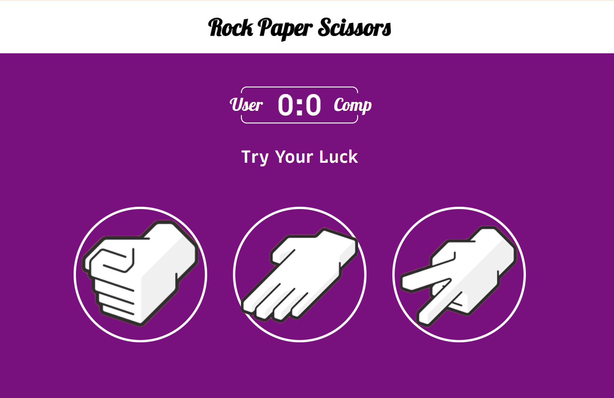

# 🪨 📄 ✂️ Rock Paper Scissors Game

Welcome to the **Rock Paper Scissors** game! This is a simple, clean, and interactive classic arcade game built using raw HTML, CSS, and Vanilla JavaScript.

It was created as a learning project to practice core web development skills (styling, event handling, DOM manipulation, and responsive design).

## 🚀 Live Demo

You can play the game live here: [Live Demo on Netlify](https://shin890-rps.netlify.app/)

---

## 📷 Gameplay Preview

Here is a preview of the user interface:

---

## ✨ Features

- **Interactive UI**: Clean, purple-themed game board with intuitive gameplay controls.
- **Scoreboard**: Real-time score tracking for both the User and the Computer.
- **Dynamic Feedback**:
  - Displays game results ("You Win 🔥", "You lost 😭", "It's a tie. Try Again 😁").
  - Colorful glows highlight the user's choice based on the outcome:
    - 🟢 **Green glow** for a Win.
    - 🔴 **Red glow** for a Loss.
    - 🔵 **Blue glow** for a Draw/Tie.
- **Responsive Design**: Optimizations for mobile, tablet, and desktop screens.

---

## 🛠️ Tech Stack

- **HTML5**: Structured markup.
- **CSS3**: Layout, colors, Google Fonts (`Lobster` & `Recursive`), glow effects, and responsive media queries.
- **JavaScript (ES6)**: Game logic, computer selection, score tracking, and dynamic DOM manipulation.

---

## 🎮 How to Play

1. Open `index.html` directly in your web browser, or visit the [Live Demo](https://shin890-rps.netlify.app/).
2. Click on one of the three choices:
   - 🪨 **Rock**
   - 📄 **Paper**
   - ✂️ **Scissors**
3. The computer will randomly make its move.
4. The scoreboard and result message will immediately update to show the outcome of the round!
